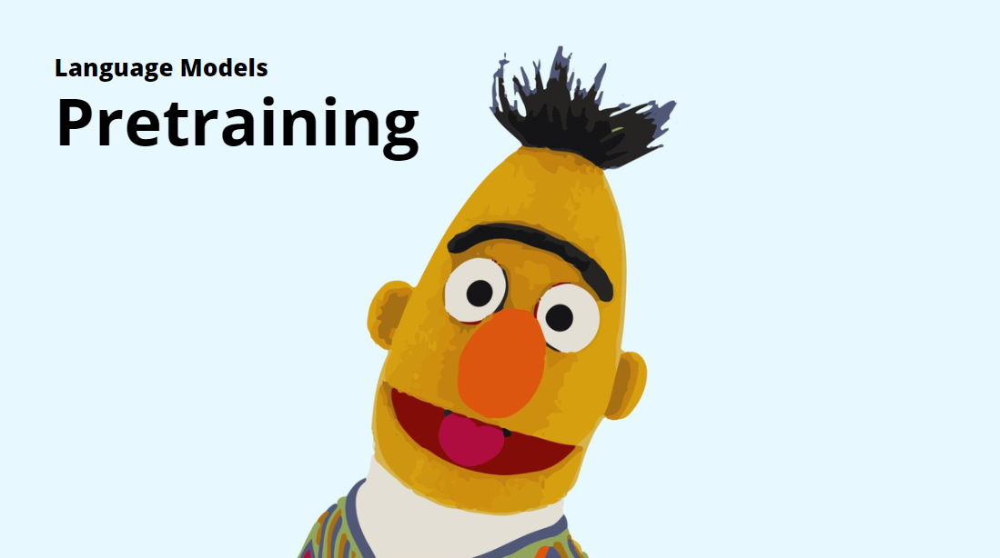

## pretraining

The pretraining library is a powerful tool for pretraining Language Models (LMs). It offers a lightweight, flexible, and high-quality API that is easy to use for researchers and developers. With a wide range of pretraining techniques available, including Masked Language Modeling, Replaced Token Detection, and Span Masking, the library offers excellent flexibility for customizing pretraining methods to specific use cases. This makes it an ideal solution for anyone looking to develop state-of-the-art language models for natural language processing tasks.

The pretraining library is backed by modern frameworks such as PyTorch, HuggingFace Transformers, and PyTorch Lightning. This ensures that the latest techniques and advancements in deep learning are integrated into the library's functionality. Additionally, the PyTorch backend provides excellent performance and scalability, making it suitable for large-scale pretraining tasks. 

Overall, the pretraining library is a comprehensive and efficient solution for pretraining Language Models with advanced techniques.

## Getting started
...

## Installation
...

## Examples
...

## TODO
- [ ] HuggingFace Transformers Data Collators wrappers
- [ ] Extend set of hyperparameters for Masked Language - [ ] Modeling: https://arxiv.org/abs/2202.08005
- [ ] Permutation Language Modeling
- [ ] Whole Word Masking
- [ ] Translation Language Modeling
- [ ] Utilities for Causal Language Modeling
- [ ] Compose
- [ ] Ready scripts for pretraining 
- [ ] Models
- [ ] Automatic sequences detection
- [ ] Make writing custom pretraining techniques more easily: provide useful utilities and a better interface.
- [ ] Types checking and better exceptions' descriptions.
- [ ] Tests
- [ ] Write docs-strings in code. 
- [ ] Examples of usage for various tasks: Named Entity Recognition, Seq2Seq, Text Generation, etc.  